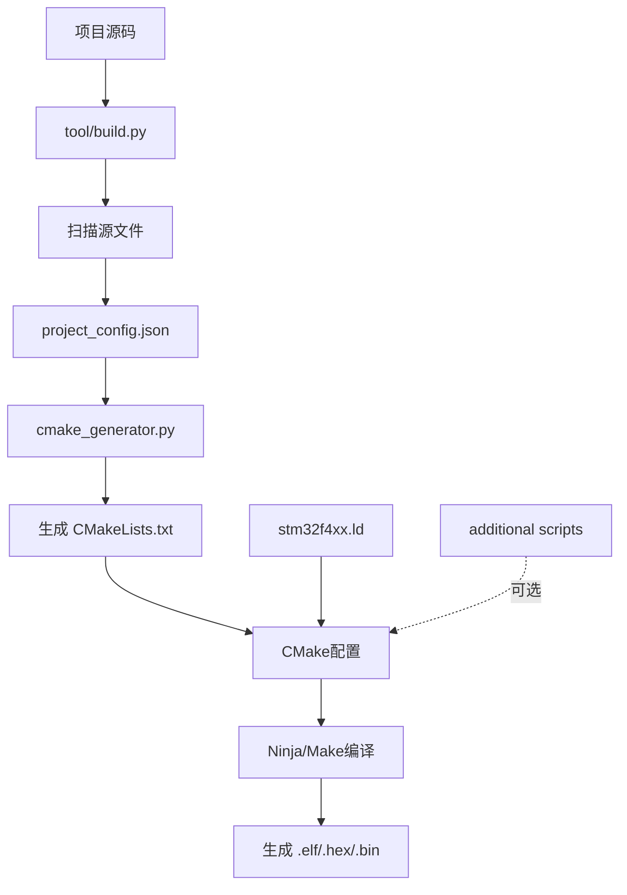

# 构建系统更新说明 - 支持自定义链接器脚本

**更新日期**：2026-01-02
**功能**：支持在构建系统中使用自定义链接器脚本，特别是驱动框架的自动初始化段

---

## ✅ 完成的修改

### 1. **主链接脚本修改** ✨

**文件**：`BSP/stm32f4/CORE/stm32f4xx.ld`

在 `.rodata` 段中添加了驱动框架自动初始化段：

```ld
.rodata :
{
    . = ALIGN(4);
    *(.rodata)
    *(.rodata*)

    /* ===== 驱动框架自动初始化段（RT-Thread风格）===== */
    . = ALIGN(4);
    __df_init_fn_start = .;
    KEEP(*(.df_init_fn.0))    /* 板级初始化（BOARD） */
    KEEP(*(.df_init_fn.1))    /* 前置初始化（PREV） */
    KEEP(*(.df_init_fn.2))    /* 设备初始化（DEVICE） */
    KEEP(*(.df_init_fn.3))    /* 组件初始化（COMPONENT） */
    KEEP(*(.df_init_fn.4))    /* 环境初始化（ENV） */
    KEEP(*(.df_init_fn.5))    /* 应用初始化（APP） */
    __df_init_fn_end = .;
    . = ALIGN(4);
} >FLASH
```

**特点**：
- ✅ 定义了6个初始化级别（0-5）
- ✅ 使用 `KEEP()` 防止链接器优化
- ✅ 自动按字典序排序执行
- ✅ 提供段边界符号 `__df_init_fn_start` 和 `__df_init_fn_end`

---

### 2. **构建脚本增强** 🛠️

#### 文件：`tool/cmake_generator.py`

**新增功能**：
1. 支持额外的链接器脚本列表
2. 自动生成多个 `-T` 链接器参数
3. 在输出中显示额外脚本信息

**关键代码**：
```python
# 构建额外的链接器脚本参数
additional_scripts = self.config.get('linker.additional_scripts', [])
additional_script_flags = ' '.join([f'-T${{CMAKE_SOURCE_DIR}}/{script}'
                                    for script in additional_scripts])
```

**生成的CMake命令**：
```cmake
set(CMAKE_EXE_LINKER_FLAGS "... -T${CMAKE_SOURCE_DIR}/BSP/stm32f4/CORE/stm32f4xx.ld -T${CMAKE_SOURCE_DIR}/Driver_Framework/linker/df_init_gcc.ld ...")
```

---

### 3. **配置文件扩展** ⚙️

**文件**：`tool/project_config.json`

新增 `linker.additional_scripts` 配置项：

```json
{
  "linker": {
    "script": "BSP/stm32f4/CORE/stm32f4xx.ld",
    "additional_scripts": [],  // 新增：额外的链接器脚本列表
    "specs": ["nosys.specs", "nano.specs"],
    ...
  }
}
```

**使用方式**：
```json
{
  "linker": {
    "script": "BSP/stm32f4/CORE/stm32f4xx.ld",
    "additional_scripts": [
      "Driver_Framework/linker/df_init_gcc.ld",
      "path/to/another_script.ld"
    ]
  }
}
```

---

### 4. **测试文件创建** 🧪

**文件**：`app/test_df_init.c`

创建了完整的初始化测试示例：

```c
#include "df_init.h"

// 各级初始化函数
static int test_board_init(void) {
    printf("[BOARD] Board initialization\n");
    return 0;
}
DF_BOARD_INIT(test_board_init);

static int test_device_init(void) {
    printf("[DEVICE] Device initialization\n");
    return 0;
}
DF_DEVICE_INIT(test_device_init);

// ... 其他级别

// 启用自动初始化
DF_INIT_AUTO_ENABLE();
```

---

## 🎯 使用方法

### 方式1：直接使用（推荐）✅

由于初始化段已集成到主链接脚本，**无需任何额外配置**。

#### 步骤1：注册初始化函数

在任意 `.c` 文件中：

```c
#include "df_init.h"

static int my_module_init(void)
{
    // 模块初始化代码
    return 0;
}
DF_DEVICE_INIT(my_module_init);
```

#### 步骤2：启用自动初始化

在某个源文件（如 `main.c`）中：

```c
DF_INIT_AUTO_ENABLE();
```

#### 步骤3：重新编译

```bash
python tool/build.py
cd build
ninja  # 或 make
```

---

### 方式2：使用额外脚本（可选）

如果需要保持主脚本不变，使用额外脚本。

#### 步骤1：修改配置

编辑 `tool/project_config.json`：

```json
{
  "linker": {
    "script": "BSP/stm32f4/CORE/stm32f4xx.ld",
    "additional_scripts": [
      "Driver_Framework/linker/df_init_gcc.ld"
    ]
  }
}
```

#### 步骤2：重新生成构建文件

```bash
python tool/build.py
```

#### 步骤3：验证

检查生成的 `CMakeLists.txt`：

```cmake
set(CMAKE_EXE_LINKER_FLAGS "... -T${CMAKE_SOURCE_DIR}/BSP/stm32f4/CORE/stm32f4xx.ld -T${CMAKE_SOURCE_DIR}/Driver_Framework/linker/df_init_gcc.ld ...")
```

---

## 📊 验证方法

### 1. 检查生成的 CMakeLists.txt

```bash
cat CMakeLists.txt | grep LINKER_FLAGS
```

应该看到：
```cmake
set(CMAKE_EXE_LINKER_FLAGS "-mcpu=cortex-m4 ... -T${CMAKE_SOURCE_DIR}/BSP/stm32f4/CORE/stm32f4xx.ld ...")
```

### 2. 查看 Map 文件

编译后检查 `build/32_temp_project.map`：

```bash
cat build/32_temp_project.map | grep df_init
```

应该看到：
```
__df_init_fn_start = 0x08001234
.df_init_fn.0      0x08001234   0x4
.df_init_fn.1      0x08001238   0x4
...
__df_init_fn_end   = 0x08001240
```

### 3. 运行测试

烧录程序后，应该看到初始化输出：

```
╔════════════════════════════════════════╗
║  Driver Framework Initialization      ║
╚════════════════════════════════════════╝
[BOARD] Board initialization
[PREV] Pre-device initialization
[DEVICE] Device initialization
[COMPONENT] Component initialization
[ENV] Environment initialization
[APP] Application initialization
════════════════════════════════════════
[DF_INIT] 6 components initialized
════════════════════════════════════════
```

---

## 🔄 构建流程



---

## 📁 文件清单

### 新增文件
- ✅ `Driver_Framework/linker/df_init_gcc.ld` - GCC链接脚本片段
- ✅ `Driver_Framework/linker/df_init_keil.sct` - Keil分散加载文件片段
- ✅ `Driver_Framework/linker/df_init_iar.icf` - IAR链接配置片段
- ✅ `Driver_Framework/linker/README.md` - 链接器配置详细说明
- ✅ `Driver_Framework/linker/构建配置说明.md` - 本文档
- ✅ `Driver_Framework/linker/df_init_usage_example.c` - 使用示例
- ✅ `app/test_df_init.c` - 测试文件

### 修改文件
- 🔧 `BSP/stm32f4/CORE/stm32f4xx.ld` - 添加初始化段
- 🔧 `tool/cmake_generator.py` - 支持额外链接脚本
- 🔧 `tool/project_config.json` - 添加配置项

### 核心文件
- 📄 `Driver_Framework/df_init.h` - 初始化系统头文件
- 📄 `Driver_Framework/df_init.c` - 初始化系统实现

---

## 🐛 故障排除

### 问题1：链接时提示 "undefined reference to '__df_init_fn_start'"

**原因**：链接器脚本中未定义初始化段

**解决**：
```bash
# 检查链接脚本
cat BSP/stm32f4/CORE/stm32f4xx.ld | grep df_init

# 应该看到段定义，如果没有则需要重新添加
```

### 问题2：构建脚本运行失败

**原因**：可能是语法错误或配置错误

**解决**：
```bash
# 查看错误信息
python tool/build.py

# 如果是配置文件错误，可以删除重新生成
rm tool/project_config.json
python tool/build.py
```

### 问题3：初始化函数没有执行

**原因**：
- 未调用 `DF_INIT_AUTO_ENABLE()`
- 段被优化掉
- 函数返回非0值

**解决**：
```c
// 1. 确保调用了自动初始化
DF_INIT_AUTO_ENABLE();

// 2. 添加调试输出
extern df_init_fn_t __df_init_fn_start;
extern df_init_fn_t __df_init_fn_end;
printf("Init section: %p to %p\n", &__df_init_fn_start, &__df_init_fn_end);

// 3. 检查Map文件
// cat build/32_temp_project.map | grep df_init
```

---

## 📖 相关文档

| 文档 | 说明 |
|------|------|
| [df_init.h](../df_init.h) | 初始化系统API文档 |
| [df_init.c](../df_init.c) | 初始化系统实现 |
| [linker/README.md](README.md) | 链接器脚本详细配置 |
| [使用示例.md](../使用示例.md) | 框架完整使用示例 |

---

## ✅ 快速测试

```bash
# 1. 重新生成构建文件
echo y | python tool/build.py

# 2. 查看生成的CMakeLists.txt
cat CMakeLists.txt | grep LINKER_FLAGS

# 3. 编译（需要CMake和工具链）
# cd build
# cmake ..
# ninja

# 4. 查看Map文件
# cat build/32_temp_project.map | grep df_init
```

---

## 🎉 总结

现在你的构建系统已经完全支持：

1. ✅ **主链接脚本集成** - 初始化段已添加到 `stm32f4xx.ld`
2. ✅ **额外脚本支持** - 可配置多个链接器脚本
3. ✅ **自动初始化** - GCC支持 constructor 自动调用
4. ✅ **灵活配置** - 通过 `project_config.json` 管理
5. ✅ **完整测试** - 提供测试文件和验证方法

**推荐使用方式**：直接使用主链接脚本（已集成初始化段），无需额外配置！

---

**维护者**：ktkuri
**更新日期**：2026-01-02
